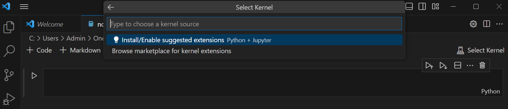
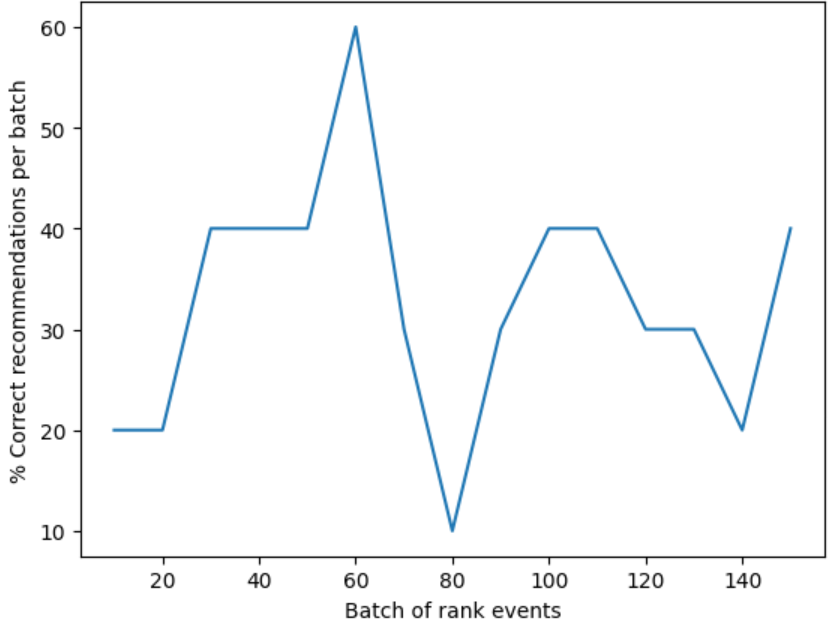

---
lab:
  title: Utiliser AI Personalizer avec des notebooks Visual Studio Code pour simuler une boucle
---
> **Important** À compter de l’automne 2023, aucune nouvelle ressource Personalizer ne peut plus être créée.

> **Remarque** Pour faire cet exercice, vous avez besoin d’un [abonnement Azure](https://azure.microsoft.com/free?azure-portal=true).

Dans cet exercice, vous allez utiliser Azure AI Personalizer avec des notebooks dans Visual Studio Code pour simuler une boucle d’apprentissage.

## Créer une ressource Azure AI Personalizer à l’aide du portail Azure

1. Dans le portail Azure, recherchez **Azure AI services**. Sélectionnez **Créer** sous **Personalizer** dans la liste des résultats.

   

1. Sélectionnez votre abonnement, entrez un nom de groupe de ressources et un nom pour votre ressource. Pour le niveau tarifaire, choisissez **F0 gratuit**.
1. Sélectionnez **Vérifier + créer** pour passer en revue vos choix, puis **Créer** pour créer votre ressource.
1. Accédez à votre nouvelle ressource Azure AI Personalizer puis, dans le volet Clés et Point de terminaison, copiez la **Clé** et le **Point de terminaison** en un endroit sûr pour une utilisation ultérieure :

   

1. Sélectionnez Configuration dans le volet de navigation, définissez la **Durée d’attente de la récompense** sur **10 minutes** (si ce n’est déjà fait), puis définissez la **Fréquence de mise à jour du modèle** sur **15 secondes**.
1. Sélectionnez **Enregistrer**.

## Configurer le notebook

1. Dans votre éditeur Visual Studio Code, appuyez sur **Ctrl+Maj+P** et sélectionnez **Créer : Notebook Jupyter**.
1. Enregistrez le fichier et nommez-le **mon notebook** sur votre appareil.
1. Vous devez maintenant installer les extensions requises. Sélectionnez **Sélectionner le noyau** en haut à droite du notebook. Sélectionnez **Installer/Activer les extensions suggérées**.

   

   > [!NOTE]
   > Si vous avez déjà effectué cette opération, vous ne verrez pas cette option et pouvez ignorer cette étape.

1. Attendez que les extensions soient installées, puis sélectionnez **Environnements Python** dans la liste déroulante qui s’affiche.
1. Sélectionnez l’environnement le plus recommandé.

## Préparer les données

Dans le cadre de cet exercice, nous allons créer une liste d’utilisateurs et une liste de produits liés au café que nous pouvons utiliser comme données de base pour notre Azure AI Personalizer.

1. Copiez le code JSON suivant dans un fichier vide et enregistrez ce fichier sous le nom `users.json` dans le même dossier que votre fichier de notebook.

   ```json
   {
     "Alice": {
       "Sunny": {
         "Morning": "Cold brew",
         "Afternoon": "Iced mocha",
         "Evening": "Cold brew"
       },
       "Rainy": {
         "Morning": "Latte",
         "Afternoon": "Cappucino",
         "Evening": "Latte"
       },
       "Snowy": {
         "Morning": "Cappucino",
         "Afternoon": "Cappucino",
         "Evening": "Cappucino"
       }
     },
     "Bob": {
       "Sunny": {
         "Morning": "Cappucino",
         "Afternoon": "Iced mocha",
         "Evening": "Cold brew"
       },
       "Rainy": {
         "Morning": "Latte",
         "Afternoon": "Latte",
         "Evening": "Latte"
       },
       "Snowy": {
         "Morning": "Iced mocha",
         "Afternoon": "Iced mocha",
         "Evening": "Iced mocha"
       }
     },
     "Cathy": {
       "Sunny": {
         "Morning": "Latte",
         "Afternoon": "Cold brew",
         "Evening": "Cappucino"
       },
       "Rainy": {
         "Morning": "Cappucino",
         "Afternoon": "Latte",
         "Evening": "Iced mocha"
       },
       "Snowy": {
         "Morning": "Cold brew",
         "Afternoon": "Iced mocha",
         "Evening": "Cappucino"
       }
     },
     "Dave": {
       "Sunny": {
         "Morning": "Iced mocha",
         "Afternoon": "Iced mocha",
         "Evening": "Iced mocha"
       },
       "Rainy": {
         "Morning": "Latte",
         "Afternoon": "Latte",
         "Evening": "Latte"
       },
       "Snowy": {
         "Morning": "Cappucino",
         "Afternoon": "Cappucino",
         "Evening": "Cappucino"
       }
     }
   }
   ```

1. Ensuite, copiez le code suivant et enregistrez-le dans un fichier nommé `coffee.json` :

   ```json
   [
     {
       "id": "Cappucino",
       "features": [
         {
           "type": "hot",
           "origin": "kenya",
           "organic": "yes",
           "roast": "dark"
         }
       ]
     },
     {
       "id": "Cold brew",
       "features": [
         {
           "type": "cold",
           "origin": "brazil",
           "organic": "yes",
           "roast": "light"
         }
       ]
     },
     {
       "id": "Iced mocha",
       "features": [
         {
           "type": "cold",
           "origin": "ethiopia",
           "organic": "no",
           "roast": "light"
         }
       ]
     },
     {
       "id": "Latte",
       "features": [
         {
           "type": "hot",
           "origin": "brazil",
           "organic": "no",
           "roast": "dark"
         }
       ]
     }
   ]
   ```

1. Copiez et collez le code suivant dans un fichier et enregistrez-le sous le nom `example-rankrequest.json` :

   ```json
   {
     "contextFeatures": [],
     "actions": [],
     "excludedActions": [],
     "eventId": "",
     "deferActivation": false
   }
   ```

## Définir votre point de terminaison et votre clé

1. En haut de votre notebook, ajoutez le code suivant pour inclure les modules requis :

   ```python
   import json
   import matplotlib.pyplot as plt
   import random
   import requests
   import time
   import uuid
   import datetime
   ```

1. Sélectionnez la cellule, puis sélectionnez le bouton Exécuter à gauche de la cellule :

   

   > [!NOTE]
   > Sélectionnez le bouton Exécuter chaque fois que vous remplissez une nouvelle cellule. Si vous êtes invité à installer le package ipykernel, sélectionnez **Installer**.

1. Sélectionnez **+ Code** en haut de votre notebook pour créer une cellule de code. Ensuite, ajoutez le code suivant :

   ```python
   # Replace 'personalization_base_url' and 'resource_key' with your valid endpoint values.
   personalization_base_url = "<your-endpoint>"
   resource_key = "<your-resource-key>"
   ```

1. Remplacez la valeur **personalization_base_url** par le point de terminaison que vous avez copié, et la valeur **resource_key** par votre clé.

## Suivre les itérations

1. Ensuite, vous créez le code pour prendre note des heures de début et de fin des fonctions itératives que vous utiliserez ultérieurement. Ajoutez le code suivant à une nouvelle cellule :

   ```python
   # Print out current datetime
   def currentDateTime():
       currentDT = datetime.datetime.now()
       print (str(currentDT))

   # ititialize variable for model's last modified date
   modelLastModified = ""

   def get_last_updated(currentModifiedDate):

       print('-----checking model')

       # get model properties
       response = requests.get(personalization_model_properties_url, headers = headers, params = None)

       print(response)
       print(response.json())

       # get lastModifiedTime
       lastModifiedTime = json.dumps(response.json()["lastModifiedTime"])

       if (currentModifiedDate != lastModifiedTime):
           currentModifiedDate = lastModifiedTime
           print(f'-----model updated: {lastModifiedTime}')
   ```

1. N’oubliez pas d’exécuter votre nouvelle cellule une fois que vous avez ajouté votre nouveau code.

## Obtenir la configuration du service et de la stratégie

1. Ensuite, vous devez valider l’état du service en obtenant la stratégie et la configuration du service. Pour ce faire, ajoutez le code suivant à une nouvelle cellule :

   ```python
   def get_service_settings():

       print('-----checking service settings')

       # get learning policy
       response = requests.get(personalization_model_policy_url, headers = headers, params = None)

       print(response)
       print(response.json())

       # get service settings
       response = requests.get(personalization_service_configuration_url, headers = headers, params = None)

       print(response)
       print(response.json())
   ```

1. Veillez à exécuter votre nouvelle cellule de code.

Le code se compose d’une fonction qui effectue deux appels à l’API de service. Lorsque la fonction est appelée, elle retourne les valeurs du service à l’aide de la réponse.

## Configurer des URL pour les appels et lire des fichiers JSON

Vous allez maintenant ajouter du code pour :

- Générer les URL utilisées dans les appels REST.
- Définir l’en-tête de sécurité à l’aide de votre clé de ressource Personalizer.
- Définir la valeur de départ aléatoire pour l’ID d’événement de classement.
- Lire les fichiers de données JSON.
- Appeler la méthode get_last_updated (la stratégie d’apprentissage a été supprimée dans l’exemple de sortie).
- Appeler la méthode get_service_settings.

1. Pour ce faire, ajoutez le code suivant à une nouvelle cellule et exécutez-le :

   ```python
   # build URLs
   personalization_rank_url = personalization_base_url + "personalizer/v1.0/rank"
   personalization_reward_url = personalization_base_url + "personalizer/v1.0/events/" #add "{eventId}/reward"
   personalization_model_properties_url = personalization_base_url + "personalizer/v1.0/model/properties"
   personalization_model_policy_url = personalization_base_url + "personalizer/v1.0/configurations/policy"
   personalization_service_configuration_url = personalization_base_url + "personalizer/v1.0/configurations/service"

   headers = {'Ocp-Apim-Subscription-Key' : resource_key, 'Content-Type': 'application/json'}

   # context
   users = "users.json"

   # action features
   coffee = "coffee.json"

   # empty JSON for Rank request
   requestpath = "example-rankrequest.json"

   # initialize random
   random.seed(time.time())

   userpref = None
   rankactionsjsonobj = None
   actionfeaturesobj = None

   with open(users) as handle:
       userpref = json.loads(handle.read())

   with open(coffee) as handle:
       actionfeaturesobj = json.loads(handle.read())

   with open(requestpath) as handle:
       rankactionsjsonobj = json.loads(handle.read())

   get_last_updated(modelLastModified)
   get_service_settings()

   print(f'User count {len(userpref)}')
   print(f'Coffee count {len(actionfeaturesobj)}')
   ```

1. L’appel doit retourner une réponse semblable à celle-ci :

   ```bash
   -----checking model
   <Response [200]>
   {'creationTime': '2023-09-22T14:58:45+00:00', 'lastModifiedTime': '2023-09-22T14:58:45+00:00'}
   -----model updated: "2023-09-22T14:58:45+00:00"
   -----checking service settings
   <Response [200]>
   {'name': '917554355a3347a1af3d2935d521426a', 'arguments': '--cb_explore_adf --epsilon 0.20000000298023224 --power_t 0 -l 0.001 --cb_type mtr -q ::'}
   <Response [200]>
   {'rewardWaitTime': 'PT10M', 'defaultReward': 0.0, 'rewardAggregation': 'earliest', 'explorationPercentage': 0.2, 'modelExportFrequency': 'PT15S', 'logRetentionDays': 90, 'lastConfigurationEditDate': '2021-01-01T00:00:00', 'learningMode': 'Online'}
   User count 4
   Coffee count 4
   ```

1. Le code de réponse doit être `<Response [200]>` pour indiquer la réussite de l’appel. **RewardWaitTime** doit indiquer 10 minutes et **modelExportFrequency** doit indiquer 15 secondes.

## Configurer un graphique dans le portail Azure

Votre code envoie des requêtes à l’API. Pour obtenir une bonne métrique de vos requêtes, vous pouvez créer un graphique de métriques dans le portail Azure :

1. Dans le portail Azure, accédez à votre ressource Azure AI Personalizer.

1. Sélectionnez **Métriques** sous Surveillance dans le volet de navigation.

   

1. Les espaces de noms **Étendue** et **Métrique** sont déjà définis pour vous. Il vous suffit de sélectionner la **Métrique** **Appels réussis** et l’**Agrégation** **Somme**.

1. Modifiez le filtre de temps sur les quatre dernières heures.

## Créer des ID d’événements uniques

Ensuite, vous ajoutez du code afin de générer un ID unique pour chaque appel d’API de classement. Vous utilisez cet ID pour identifier les informations d’appel de récompense et de classement pour les requêtes.

1. Pour ce faire, créez une cellule de code dans votre notebook et ajoutez ce qui suit :

   ```python
   def add_event_id(rankjsonobj):
       eventid = uuid.uuid4().hex
       rankjsonobj["eventId"] = eventid
       return eventid
   ```

1. N’oubliez pas d’exécuter votre nouvelle cellule de code.

> [!NOTE]
> Dans un scénario réel, vous définiriez cette valeur sur quelque chose comme l’ID de transaction pour un achat.

## Obtenir un utilisateur, l’heure de la journée et la météo

Vous pouvez maintenant ajouter une fonction pour :

- Sélectionner un combinaison unique d’utilisateur, d’heure de la journée et de météo.
- Ajouter ces éléments sélectionnés à un objet JSON qui sera envoyé à l’API de classement via un appel.

Pour ce faire, ajoutez le code suivant à une nouvelle cellule et exécutez-le :

```python
def add_random_user_and_contextfeatures(namesoption, weatheropt, timeofdayopt, rankjsonobj):
    name = namesoption[random.randint(0,3)]
    weather = weatheropt[random.randint(0,2)]
    timeofday = timeofdayopt[random.randint(0,2)]
    rankjsonobj['contextFeatures'] = [{'timeofday': timeofday, 'weather': weather, 'name': name}]
    return [name, weather, timeofday]
```

## Ajouter des données liés au café

Ensuite, vous créez une fonction pour obtenir la liste complète des produits liés au café à un objet JSON que vous envoyez ensuite à l’API de classement.

Pour ce faire, ajoutez le code suivant à une nouvelle cellule, et exécutez-le :

```python
def add_action_features(rankjsonobj):
    rankjsonobj["actions"] = actionfeaturesobj
```

## Comparer les prédictions avec la préférence connue de l’utilisateur

Vous pouvez ensuite créer une fonction pour comparer la préférence d’un utilisateur en matière de café, en tenant compte de détails tels que la météo et l’heure de la journée, avec ce qu’Azure AI Personalizer suggère.

1. Pour ce faire, créez une cellule, ajoutez le code suivant et exécutez-le :

   ```python
   def get_reward_from_simulated_data(name, weather, timeofday, prediction):
       if(userpref[name][weather][timeofday] == str(prediction)):
           return 1
       return 0
   ```

1. Cette fonction est destinée à s’exécuter après chaque appel à l’API de classement. Si la suggestion correspond, un score de `1` est retourné dans la réponse. Si elle ne correspond pas, `0` est retourné.

## Créer une boucle avec des appels aux API de classement et de récompense

Les cellules précédentes sont utilisées afin de configurer votre notebook pour la boucle. Vous allez maintenant configurer votre boucle. La boucle couvre la plupart du travail dans votre notebook. Elle obtient un utilisateur aléatoire, obtient la liste des cafés, et les envoie tous deux à l’API de classement. Elle compare la prédiction d’Azure AI Personalizer avec les préférences connues de cet utilisateur, puis renvoie la récompense à Azure AI Personalizer.

Pour créer votre boucle, ajoutez le code suivant à une nouvelle cellule et exécutez-le :

```python
def iterations(n, modelCheck, jsonFormat):

    i = 1

    # default reward value - assumes failed prediction
    reward = 0

    # Print out dateTime
    currentDateTime()

    # collect results to aggregate in graph
    total = 0
    rewards = []
    count = []

    # default list of user, weather, time of day
    namesopt = ['Alice', 'Bob', 'Cathy', 'Dave']
    weatheropt = ['Sunny', 'Rainy', 'Snowy']
    timeofdayopt = ['Morning', 'Afternoon', 'Evening']


    while(i <= n):

        # create unique id to associate with an event
        eventid = add_event_id(jsonFormat)

        # generate a random sample
        [name, weather, timeofday] = add_random_user_and_contextfeatures(namesopt, weatheropt, timeofdayopt, jsonFormat)

        # add action features to rank
        add_action_features(jsonFormat)

        # show JSON to send to Rank
        print('To: ', jsonFormat)

        # choose an action - get prediction from Personalizer
        response = requests.post(personalization_rank_url, headers = headers, params = None, json = jsonFormat)

        # show Rank prediction
        print ('From: ',response.json())

        # compare personalization service recommendation with the simulated data to generate a reward value
        prediction = json.dumps(response.json()["rewardActionId"]).replace('"','')
        reward = get_reward_from_simulated_data(name, weather, timeofday, prediction)*10

        # show result for iteration
        print(f'   {i} {currentDateTime()} {name} {weather} {timeofday} {prediction} {reward}')

        # send the reward to the service
        response = requests.post(personalization_reward_url + eventid + "/reward", headers = headers, params= None, json = { "value" : reward })

        # for every N rank requests, compute total correct  total
        total =  total + reward

        # every N iteration, get last updated model date and time
        if(i % modelCheck == 0):

            print("**** 10% of loop found")

            get_last_updated(modelLastModified)

        # aggregate so chart is easier to read
        if(i % 10 == 0):
            rewards.append( total)
            count.append(i)
            total = 0

        i = i + 1

    # Print out dateTime
    currentDateTime()

    return [count, rewards]
```

Voici un exemple de la structure JSON que la fonction envoie à l’API de classement :

```python
{
    'contextFeatures':[
      {
          'timeofday':'Evening',
          'weather':'Snowy',
          'name':'Alice'
      }
    ],
    'actions':[
      {
          'id':'Cappucino',
          'features':[
            {
                'type':'hot',
                'origin':'kenya',
                'organic':'yes',
                'roast':'dark'
            }
          ]
      }
        ...rest of the coffee list
    ],
    'excludedActions':[

    ],
    'eventId':'b5c4ef3e8c434f358382b04be8963f62',
    'deferActivation':False
}
```

L’API de classement répond avec une réponse structurée comme suit :

```python
{
    'ranking': [
        {'id': 'Latte', 'probability': 0.85 },
        {'id': 'Iced mocha', 'probability': 0.05 },
        {'id': 'Cappucino', 'probability': 0.05 },
        {'id': 'Cold brew', 'probability': 0.05 }
    ],
    'eventId': '5001bcfe3bb542a1a238e6d18d57f2d2',
    'rewardActionId': 'Latte'
}
```

Chaque itération de boucle affiche l’utilisateur, la météo et l’heure de la journée sélectionnés aléatoirement, ainsi que la récompense appropriée :

```bash
1 Alice Rainy Morning Latte 1
```

Une récompense `1` signifie que votre ressource Azure AI Personalizer a sélectionné le type de café approprié pour cette combinaison particulière d’utilisateur, de météo et d’heure de la journée.

## Exécuter la boucle et afficher les résultats du graphique

Azure AI Personalizer a besoin de quelques milliers d’appels à l’API de classement et à l’API de récompense pour créer un modèle. Vous allez exécuter votre boucle un nombre défini d’itérations.

1. Pour ce faire, créez une cellule de code, ajoutez le code suivant et exécutez-le :

   ```python
   # max iterations
   num_requests = 150

   # check last mod date N% of time - currently 10%
   lastModCheck = int(num_requests * .10)

   jsonTemplate = rankactionsjsonobj

   # main iterations
   [count, rewards] = iterations(num_requests, lastModCheck, jsonTemplate)
   ```

1. Actualisez de temps en temps votre graphique de métriques dans le portail Azure pour voir le nombre total d’appels au service.
1. Cet événement peut s’exécuter pendant un certain temps. Ne fermez pas votre notebook tant qu’il n’est pas terminé. Lorsque la boucle a effectué environ 20 000 appels (un appel de classement et de récompense pour chaque itération de la boucle), la boucle se termine.

1. Ensuite, vous créez un graphique dans votre notebook pour tracer les lots d’événements de classement et le nombre de recommandations correctes faites pour chaque lot. Pour ce faire, ajoutez le code suivant dans une nouvelle cellule et exécutez-le :

   ```python
   def createChart(x, y):
       plt.plot(x, y)
       plt.xlabel("Batch of rank events")
       plt.ylabel("Correct recommendations per batch")
       plt.show()

   createChart(count,rewards)
   ```

1. Votre notebook crée un graphique :

   

> **Conseil :** Dans l’idéal, une fois le test terminé, votre boucle doit en moyenne faire des recommandations correctes à un taux de 100 % moins la valeur d’exploration (soit 20 % par défaut) ; le taux cible est donc ici de 80 %. L’une des manières d’y parvenir consiste à augmenter les itérations jusqu’à au moins 10 000.

Le graphique affiche le degré de réussite de votre modèle en fonction de la stratégie d’apprentissage par défaut. Ce graphique montre que la stratégie d’apprentissage peut être améliorée. Vous pouvez pour cela modifier la stratégie après avoir exécuté des évaluations.

## Exécuter une évaluation hors connexion

> [!NOTE]
> Cette section de cet exercice est facultative, car elle ne peut être effectuée qu’après au moins 50 000 appels à votre ressource Azure AI Personalizer. Mais vous pouvez revenir à cette section si, à un moment donné, vous avez atteint 50 000 appels sur votre ressource.

Vous pouvez exécuter une évaluation hors connexion afin de trouver une meilleure stratégie d’apprentissage pour une ressource Azure AI Personalizer avec au moins 50 000 appels.

1. Dans le portail Azure, accédez au volet Optimiser de votre ressource Azure AI Personalizer, puis sélectionnez **Créer une évaluation**.
1. Fournissez un nom d’évaluation, puis sélectionnez une plage de dates de début et de fin pour votre évaluation en boucle. Votre plage de dates doit inclure uniquement les jours sur lesquels vous vous concentrez pour votre évaluation :

   

1. Sélectionnez **Démarrer l’évaluation** pour commencer votre évaluation.

1. Une fois l’évaluation terminée, sélectionnez-la dans la liste des évaluations dans le volet Optimiser. Ensuite, passez en revue les performances de vos stratégies d’apprentissage en fonction de détails tels que leur récompense moyenne, les intervalles de confiance, etc. :

   

1. Vous verrez quelques stratégies, notamment :

   - **Online** : la stratégie actuelle de votre Azure AI Personalizer.
   - **Baseline1** : la stratégie de ligne de base de votre application
   - **BaselineRand** : une stratégie d’action aléatoires.
   - **Inter-len#** ou **Hyper#**  : des stratégies créées par la découverte d’optimisation.

1. Sélectionnez **Appliquer** sur la stratégie qui améliore le mieux le modèle.

## Nettoyer les ressources

Si vous n’utilisez pas les ressources Azure créées dans ce labo pour d’autres modules de formation, vous pouvez les supprimer pour éviter d’autres frais.

1. Ouvrez le Portail Azure à l'adresse `https://portal.azure.com` et, dans la barre de recherche supérieure, recherchez les ressources que vous avez créées dans ce labo.

2. Dans la page de ressources, sélectionnez **Supprimer** et suivez les instructions pour supprimer la ressource. Vous pouvez également supprimer l’intégralité du groupe de ressources pour nettoyer toutes les ressources en même temps.
